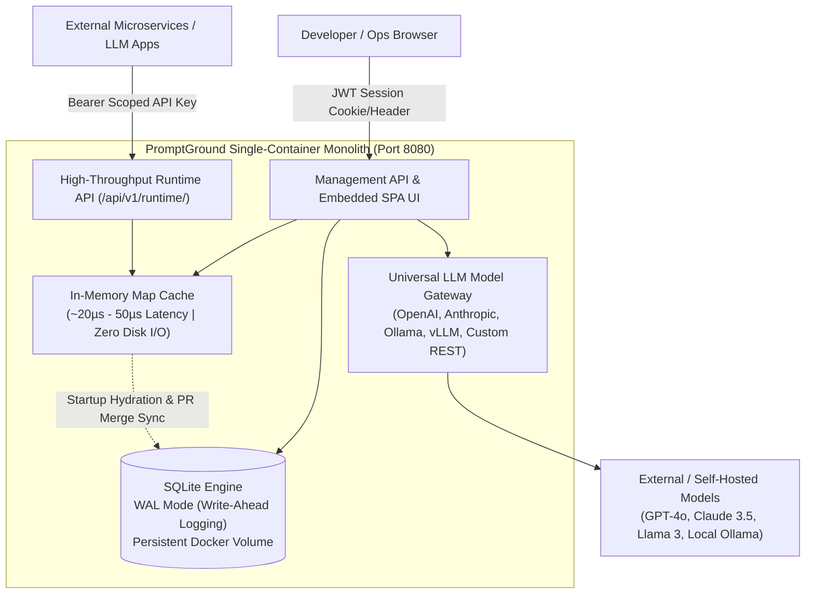

# PromptGround — Enterprise Prompt Registry & LLMOps Engine

<div align="center">


**A high-performance, self-hosted Prompt Registry and LLMOps Engine packaged as a single-container monolith.**  
Features sub-millisecond in-memory prompt template retrieval, GitOps-style Promotion Pull Requests with side-by-side visual diffs, multi-model execution gateway, granular RBAC with per-prompt isolation, scoped API keys, and SQLite Write-Ahead Logging (WAL) persistent storage.

[Architecture](#architecture-overview) • [Key Features](#key-features--functionality) • [Technology Stack](#technology-stack) • [Quick Start](#quick-start--installation) • [User & Admin Guide](#user--admin-guide) • [Runtime API Reference](#runtime-api-reference) • [Database Schema](#database-schema)

</div>

---

## Architecture Overview

PromptGround is architected for extreme speed, strict governance, and zero operational overhead:



### Architectural Principles
1. **Full-Stack Monolith in a Single Container**: A single Node.js process serves both the compiled React dashboard and high-throughput runtime endpoints on port `8080`. No separate database clusters or Redis brokers are required.
2. **Sub-Millisecond Dual-Tier Caching**: At boot, active production, staging, and development prompts are pre-hydrated into an in-memory JavaScript `Map`. Runtime lookups take **~20 µs**, and template variable interpolations take **~25 µs** without hitting disk.
3. **ACID Persistence via SQLite WAL Mode**: Write-Ahead Logging (`PRAGMA journal_mode = WAL;`) enables concurrent reads and writes with zero lock contention, persisted to a Docker volume.
4. **Promotion Pull Request Workflow**: Prompts follow a promotion lifecycle (`development` ➔ `staging` ➔ `production`). Direct modifications to upper environments are guarded by promotion reviews with side-by-side diffs.
5. **Universal LLM Gateway**: Connect any LLM endpoint (OpenAI, Anthropic, Gemini, Ollama, vLLM, or proprietary REST APIs with custom headers) directly in the admin panel. Test live prompts in the playground without modifying application code.

---

## Key Features & Functionality

### 1. High-Throughput Runtime Engine
* **Sub-Millisecond Resolution**: Fetch active prompt templates in microseconds using clean slug lookups: `GET /api/v1/runtime/prompts/:slug?env=production`.
* **Zero-Latency Variable Hydration**: Send input parameters to `POST /api/v1/runtime/render/:slug` to receive a fully interpolated prompt ready for inference.
* **Cache Telemetry**: Every runtime response includes `X-Cache: HIT` and `X-Cache-Lookup-Time-Microseconds` performance headers.

### 2. Promotion Pull Requests & Visual Diff Inspector
* **GitOps Promotion**: Create promotion pull requests to propose shifting a prompt version from `development` to `staging` or `production`.
* **Side-by-Side & Unified Diffs**: Inspect line-by-line additions, deletions, and variable changes before promoting.
* **Atomic Merge & Pointer Shift**: Approving and merging a PR automatically shifts active environment pointers and immediately updates the in-memory cache.

### 3. Universal LLM Model Gateway & Test Playground
* **Multi-Provider Support**: Admins can register OpenAI, Anthropic, Google Gemini, Ollama, self-hosted vLLM, or arbitrary REST endpoints with custom bearer tokens or API key headers.
* **Interactive Test Playground**:
  * Test prompt templates by entering runtime variable parameters.
  * Execute prompts against any connected model to compare latency, tokens, and output formatting.
  * **Explicit "None" State**: If no models have been added by an administrator, the playground displays a clear `None` indicator and allows safe "Template Hydration Only" mode.

### 4. Enterprise RBAC & Prompt Isolation
* **Three Role Tiers**:
  * **Admin**: Full control over system settings, SMTP, connected models, API keys, user management, and prompt access overrides.
  * **Editor**: Author prompt versions in `development`, raise promotion PRs, and review PRs for assigned prompts.
  * **Viewer**: Read-only access to assigned prompts and playground execution.
* **Environment-Level Access**: Users are granted access only to specific environments (`development`, `staging`, and/or `production`).
* **Strict Prompt-Level Isolation**:
  * Users only see prompts they created or were explicitly granted access to via `user_prompt_access`.
  * Unassigned users cannot see prompts, view pull requests, raise promotion requests, or merge changes.
  * Developers with access only to `development` cannot merge PRs into `staging` or `production`.

### 5. Scoped API Keys
* External services authenticate with environment-bound API tokens (e.g. `ph_live_...`, `ph_stg_...`, `ph_dev_...`).
* API keys are hashed with SHA-256 and checked against the in-memory cache.
* Production API keys are strictly rejected if used to request staging or development prompts, preventing cross-environment data leaks.

### 6. Admin SMTP Email Notifications
* Configure SMTP settings (`host`, `port`, `user`, `pass`, `fromEmail`) directly in the Settings tab.
* Includes a live "Send Test Email" diagnostic tool to verify outbound mail delivery.

### 7. Modern Obsidian UI & Collapsible Sidenav
* Modern dark-mode interface built with CSS variables, smooth glassmorphism, and responsive layouts.
* **Hide / Show Sidebar**: Toggle the sidebar anytime using the header toggle button or the **`Cmd+B` / `Ctrl+B`** keyboard shortcut for a distraction-free, full-width canvas.

---

## Technology Stack

| Layer | Technology | Description |
|---|---|---|
| **Monolith Server** | Node.js (v20+) & Express | Serves both runtime microservice endpoints and static React frontend assets from one process. |
| **Database** | SQLite 3 (`better-sqlite3`) | High-performance embedded database running in WAL mode with indexed lookups and ACID safety. |
| **Cache Layer** | In-Memory JavaScript `Map` | Sub-millisecond prompt and API key lookup cache populated on boot and updated on merge. |
| **Frontend UI** | React 18 & Vite | Fast, responsive single-page application bundled with Lucide icons. |
| **Styling** | Vanilla CSS Design Tokens | Obsidian dark-mode palette, custom glassmorphism, responsive grid layouts, and zero heavy UI dependencies. |
| **Containerization** | Docker & Docker Compose | Multi-stage build producing a lightweight, self-contained production image. |

---

## Quick Start & Installation

### Option A: Docker Compose (Recommended)

1. Clone the repository:
   ```bash
   git clone https://github.com/PromptGround/PromptGround.git
   cd PromptGround
   ```

2. Configure environment variables (optional):
   ```bash
   cp .env.example .env
   ```
   *You can customize `ADMIN_USERNAME` and `ADMIN_PASSWORD` in `.env` or `docker-compose.yml`.*

3. Start the engine:
   ```bash
   docker compose up -d --build
   ```

4. Open the dashboard:
   * **URL**: [http://localhost:8080](http://localhost:8080)
   * **Default Username**: `admin`
   * **Default Password**: `admin123` *(or your configured `ADMIN_PASSWORD`)*

---

### Option B: Local Node.js Development

**Prerequisites**: Node.js v20+ and npm.

1. Clone and install root dependencies:
   ```bash
   git clone https://github.com/PromptGround/PromptGround.git
   cd PromptGround
   npm run install:all
   ```

2. Build the React frontend:
   ```bash
   cd frontend
   npm run build
   rm -rf ../backend/public && cp -r dist ../backend/public
   cd ..
   ```

3. Start the backend monolith:
   ```bash
   cd backend
   node server.js
   ```

4. Run the automated integration test suite:
   ```bash
   node tests/test_engine.js
   ```

---

## User & Admin Guide

### 1. Managing Prompts
1. Navigate to **Prompt Registry** in the sidebar.
2. Click **+ New Prompt Template**, provide a name (e.g. `Customer Support Copilot`), a unique slug (`customer-support-copilot`), and your initial template using `{{variable_name}}` placeholders:
   ```text
   You are an AI customer support assistant for {{company_name}}.
   User Tier: {{account_tier}}
   User Inquiry: {{inquiry_text}}
   Respond politely and address their issue step-by-step.
   ```
3. PromptGround automatically parses and indexes all template variables.

### 2. Testing in the Live Playground
1. Open any prompt in the registry and navigate to the **Test Playground** tab.
2. Select the target environment (`development`, `staging`, or `production`).
3. Choose your execution mode:
   * **Template Hydration Only**: Interpolates your variable values with zero LLM inference cost.
   * **Run with Connected Model**: Sends the hydrated prompt to your selected LLM and inspects the live completion, tokens, and latency.
   * *If no models are configured by the admin, the playground displays `None`, cleanly disabling model execution while keeping hydration active.*

### 3. Promoting via Pull Requests
1. When you commit a new version in `development`, click **Raise Promotion PR**.
2. Select the target environment (`staging` or `production`), assign a reviewer, and click **Create Promotion PR**.
3. In the **Promotion PRs** tab, inspect the side-by-side visual diff showing exact lines added, removed, or modified.
4. When approved, click **Merge & Promote**. The prompt immediately becomes the active pointer in the target environment and updates the in-memory cache.

### 4. Connecting LLM Models (Admin)
1. Navigate to **Engine Settings** > **Connected LLM Models**.
2. Click **+ Connect Model** and configure:
   * **Provider Type**: `openai`, `anthropic`, `gemini`, `ollama`, or `custom`.
   * **Base URL**: e.g., `https://api.openai.com/v1` or `http://localhost:11434`.
   * **Model ID**: e.g., `gpt-4o-mini`, `claude-3-5-sonnet-20241022`, or `llama3`.
   * **API Key / Credentials**: Stored securely and masked in the UI.
   * **Custom Headers**: Custom JSON headers for internal proxy authentication.
3. Click **Test Connection** to verify connectivity before saving.

### 5. Access Control & Permissions (Admin)
1. Go to **Access Control**.
2. Create team members with roles: `admin`, `editor`, or `viewer`.
3. Configure environment access (e.g. restrict junior developers to `development` only).
4. Assign per-prompt permissions (`read`, `write`, `admin`) to ensure least-privilege access across teams.

### 6. Sidenav Bar Toggle
* Click the collapse button in the sidebar header or in the top navigation bar.
* Or press **`Cmd+B`** (macOS) / **`Ctrl+B`** (Linux/Windows) to toggle the sidebar anytime.

---

## Runtime API Reference

PromptGround provides clean, ultra-low-latency runtime endpoints for production microservices:

### 1. Fetch Active Prompt Template
```http
GET /api/v1/runtime/prompts/:slug?env=production
Authorization: Bearer <API_KEY>
```
**Response (Cache Hit ~20µs)**:
```json
{
  "promptId": "prm_cust_01",
  "slug": "customer-support-copilot",
  "name": "Customer Support Copilot",
  "version": 4,
  "environment": "production",
  "templateContent": "You are a customer assistant for {{company_name}}...",
  "variables": ["company_name", "account_tier", "inquiry_text"],
  "cacheHit": true,
  "lookupLatencyMicroseconds": 18.4
}
```

### 2. Zero-Latency Variable Hydration
```http
POST /api/v1/runtime/render/:slug
Authorization: Bearer <API_KEY>
Content-Type: application/json

{
  "env": "production",
  "variables": {
    "company_name": "Acme Cloud",
    "account_tier": "Enterprise",
    "inquiry_text": "How do I configure SSO?"
  }
}
```
**Response**:
```json
{
  "slug": "customer-support-copilot",
  "version": 4,
  "environment": "production",
  "rendered": "You are a customer assistant for Acme Cloud.\nUser Tier: Enterprise\nUser Inquiry: How do I configure SSO?...",
  "missingVariables": [],
  "cacheHit": true,
  "durationMicroseconds": 22.8
}
```

### 3. Model Execution Gateway
```http
POST /api/v1/runtime/execute/:slug
Authorization: Bearer <API_KEY>
Content-Type: application/json

{
  "env": "production",
  "modelId": "mod_openai_4o",
  "variables": { "company_name": "Acme Cloud" },
  "options": { "temperature": 0.7, "maxTokens": 1024 }
}
```

### 4. Health & Observability Telemetry
```http
GET /api/v1/health
```
```json
{
  "status": "healthy",
  "database": "SQLite WAL",
  "cacheHydrated": true,
  "activeCachedPrompts": 12,
  "activeApiKeys": 4
}
```

---

## Database Schema

PromptGround uses 9 relational SQLite tables with foreign keys and indexes:

```sql
-- Users and authentication
CREATE TABLE users (
    id TEXT PRIMARY KEY,
    username TEXT UNIQUE NOT NULL,
    password_hash TEXT NOT NULL,
    role TEXT CHECK(role IN ('admin', 'editor', 'viewer')) NOT NULL,
    created_at DATETIME DEFAULT CURRENT_TIMESTAMP
);

-- Prompts metadata
CREATE TABLE prompts (
    id TEXT PRIMARY KEY,
    slug TEXT UNIQUE NOT NULL,
    name TEXT NOT NULL,
    description TEXT,
    created_by TEXT,
    created_at DATETIME DEFAULT CURRENT_TIMESTAMP,
    FOREIGN KEY (created_by) REFERENCES users(id)
);

-- Version history and environment pointers
CREATE TABLE prompt_versions (
    id TEXT PRIMARY KEY,
    prompt_id TEXT NOT NULL,
    version_number INTEGER NOT NULL,
    template_content TEXT NOT NULL,
    variables TEXT, -- JSON array of parsed variable names
    environment TEXT CHECK(environment IN ('development', 'staging', 'production')) NOT NULL,
    changelog TEXT,
    created_by TEXT,
    created_at DATETIME DEFAULT CURRENT_TIMESTAMP,
    FOREIGN KEY (prompt_id) REFERENCES prompts(id),
    FOREIGN KEY (created_by) REFERENCES users(id)
);

-- Environment-level access boundaries
CREATE TABLE user_environment_access (
    user_id TEXT NOT NULL,
    environment TEXT CHECK(environment IN ('development', 'staging', 'production')) NOT NULL,
    PRIMARY KEY (user_id, environment),
    FOREIGN KEY (user_id) REFERENCES users(id)
);

-- Granular per-prompt access overrides
CREATE TABLE user_prompt_access (
    user_id TEXT NOT NULL,
    prompt_id TEXT NOT NULL,
    access_level TEXT CHECK(access_level IN ('read', 'write', 'admin')) NOT NULL,
    PRIMARY KEY (user_id, prompt_id),
    FOREIGN KEY (user_id) REFERENCES users(id),
    FOREIGN KEY (prompt_id) REFERENCES prompts(id)
);

-- Scoped API keys for runtime callers
CREATE TABLE api_keys (
    id TEXT PRIMARY KEY,
    key_hash TEXT UNIQUE NOT NULL,
    name TEXT NOT NULL,
    environment TEXT CHECK(environment IN ('development', 'staging', 'production')) NOT NULL,
    created_by TEXT,
    created_at DATETIME DEFAULT CURRENT_TIMESTAMP,
    FOREIGN KEY (created_by) REFERENCES users(id)
);

-- Promotion pull requests for review & approval
CREATE TABLE prompt_pull_requests (
    id TEXT PRIMARY KEY,
    prompt_id TEXT NOT NULL,
    source_version_id TEXT NOT NULL,
    target_environment TEXT CHECK(target_environment IN ('staging', 'production')) NOT NULL,
    author_id TEXT NOT NULL,
    assignee_id TEXT NOT NULL,
    status TEXT CHECK(status IN ('open', 'merged', 'rejected')) DEFAULT 'open',
    title TEXT NOT NULL,
    description TEXT,
    created_at DATETIME DEFAULT CURRENT_TIMESTAMP,
    FOREIGN KEY (prompt_id) REFERENCES prompts(id),
    FOREIGN KEY (source_version_id) REFERENCES prompt_versions(id),
    FOREIGN KEY (author_id) REFERENCES users(id),
    FOREIGN KEY (assignee_id) REFERENCES users(id)
);

-- Connected LLM Model Providers
CREATE TABLE llm_providers (
    id TEXT PRIMARY KEY,
    name TEXT NOT NULL,
    provider_type TEXT CHECK(provider_type IN ('openai', 'anthropic', 'gemini', 'ollama', 'custom')) NOT NULL,
    base_url TEXT NOT NULL,
    api_key TEXT,
    model_id TEXT NOT NULL,
    custom_headers TEXT DEFAULT '{}',
    default_params TEXT DEFAULT '{}',
    created_by TEXT,
    created_at DATETIME DEFAULT CURRENT_TIMESTAMP,
    FOREIGN KEY (created_by) REFERENCES users(id)
);

-- System Configurations & SMTP Settings
CREATE TABLE system_settings (
    key TEXT PRIMARY KEY,
    value TEXT NOT NULL
);
```

---

## Testing & Quality Assurance

PromptGround includes a comprehensive integration test suite verifying end-to-end functionality:

```bash
# Run tests against the active engine
node tests/test_engine.js
```

**Test Suite Coverage**:
1. Health check & SQLite WAL mode validation
2. Monolithic single-container static UI delivery
3. Sub-millisecond runtime retrieval from in-memory Map cache (~2µs - 20µs)
4. Runtime parameter interpolation with zero disk I/O (~15µs - 25µs)
5. API Key environment scoping enforcement (production key rejected on staging)
6. Rejection of invalid and revoked API keys
7. Promotion PR creation, side-by-side diff verification, and atomic merge cache shift
8. User environment permission matrix enforcement
9. Connected LLM model registration and live test ping
10. Self-service password updates and Admin password reset
11. Admin SMTP configuration and test dispatch simulation
12. Strict RBAC enforcement preventing non-admins from accessing settings or creating keys
13. Dev editor isolation preventing unassigned users from seeing prompts, creating PRs, or merging into unauthorized environments

---

## License

PromptGround is licensed under the [Apache License 2.0](LICENSE).
